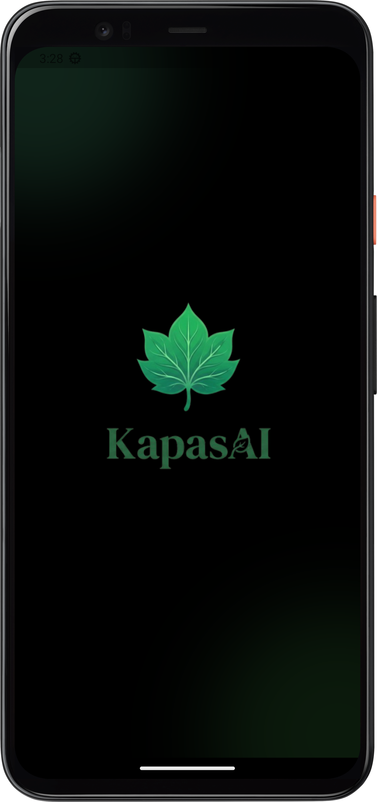
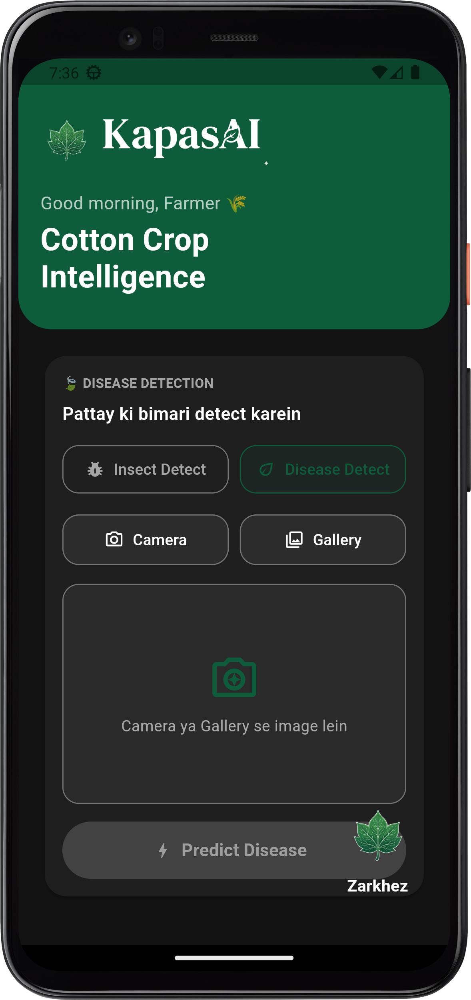
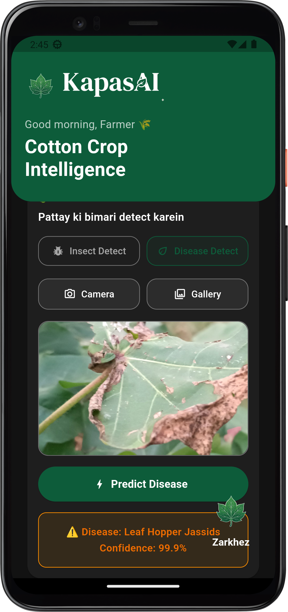
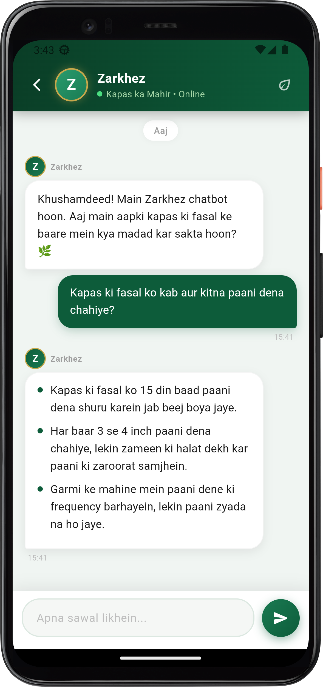

# 🌱 KapasAI - Intelligent Cotton Farming Ecosystem

> **KapasAI** is a complete AI-powered cotton farming platform that combines **Deep Learning**, **Multi-Agent AI Systems**, **Retrieval-Augmented Generation (RAG)**, **Mobile Applications**, and **API Services** to assist farmers in disease detection, insect identification, crop management, and agricultural decision-making.

The project is designed to provide end-to-end support for cotton farmers through image-based diagnosis, expert advisory systems, and mobile accessibility.

---

## APP Interface

| Splash Screen | Home | Disease Prediction Result | Zarkhez Chatbot Interface |
| :---: | :---: | :---: | :---: |
|  |  |  |  |

---

## Project Overview

KapasAI consists of multiple integrated modules:

1. **Dataset Sources** – Documentation and dataset references used for model training.
2. **Deep Learning Model Training** – Cotton disease and insect detection models built using MobileNetV2.
3. **Cotton Multi-Agent Advisory System** – AI agents that provide farming guidance, disease prevention, and spray recommendations.
4. **API Backend** – REST API layer connecting the AI system with external applications.
5. **Android Application** – Mobile application for farmers.
6. **Application Screenshots** – UI demonstrations and project visuals.

---

## 📂 Project Structure

```text
KAPASAI/
│
├── 1_dataset_sources/
│   ├── cotton_leaf_disease_detection_data.txt
│   └── cotton_leaf_insect_detection_data.txt
│
├── 2_model_training/
│   ├── insect_detection_model_training/
│   ├── leaf_disease_detection_model_training/
│   ├── cotton_insect_mobilenetv2.keras
│   └── README.md
│
├── 3_cotton_multi_agent/
│   ├── agents/
│   ├── config/
│   ├── evaluation/
│   ├── knowledge_base/
│   ├── tests/
│   ├── vectordb/
│   ├── README.md
│   └── test_supervisor.py
│
├── 4_api_backend/
│   ├── main.py
│   ├── requirements.txt
│   └── README.md
│
├── 5_android_app/
│
├── 6_mobile_app_screenshots/
│
└── README.md
```


---

### Important Note Before Running the Project

> **Important:** Please remove the numbering prefix (e.g., `1_`, `2_`) from the folder or file names before running the project. 
> 
> These numbers were only added to maintain the correct step-by-step order of the Folder structure in the repository and are not part of the actual source code configuration.
---

## 📁 Folder Details

### 1️⃣ Dataset Sources

```text
1_dataset_sources/
```

This directory contains references about the datasets used for training the cotton disease and insect detection models.


---

### 2️⃣ Model Training Module

```text
2_model_training/
```

This module contains all resources related to Deep Learning model development for disease and insect detection.

#### Features

- Transfer Learning with MobileNetV2
- TensorFlow/Keras Implementation
- Disease Classification
- Insect Classification
- TensorFlow Lite Export
- Mobile Deployment Ready Models

#### Submodules

##### Disease Detection Model

```text
leaf_disease_detection_model_training/
```

Contains:

- Training Notebook
- Disease Detection Model
- TensorFlow Lite Model
- Label Files

##### Insect Detection Model

```text
insect_detection_model_training/
```

Contains:

- Training Notebook
- Insect Detection Model
- TensorFlow Lite Model
- Label Files

#### Outputs

- `.keras` Models
- `.tflite` Models
- Label Files


---

### 3️⃣ Cotton Multi-Agent Advisory System

```text
3_cotton_multi_agent/
```

This module is the intelligence layer of KapasAI.

It uses:

- Multi-Agent Architecture
- LangGraph Workflows
- LangChain
- OpenAI Models
- Retrieval-Augmented Generation (RAG)
- FAISS Vector Databases

#### Core Components

##### Supervisor Agent

Responsible for:

- User query understanding
- Task routing
- Agent coordination
- Response generation

##### Disease Expert Agent

Provides:

- Disease prevention guidance
- Cotton farming best practices
- Disease management recommendations

##### Spray & Weather Expert Agent

Provides:

- Spray recommendations
- Pest management guidance
- Treatment suggestions

#### Additional Resources

- Knowledge Base
- Vector Databases
- Evaluation Reports
- Automated Tests
- Configuration Files

> 📖 **For complete architecture, workflow diagrams, setup instructions, agent descriptions, RAG implementation details, and evaluation reports, please refer to the README inside the `3_cotton_multi_agent` folder.**

---

### 4️⃣ API Backend

```text
4_api_backend/
```

The API Backend acts as the communication bridge between the mobile application and the AI system.

#### Responsibilities

- Receives requests from client applications
- Processes user queries
- Communicates with AI services
- Returns structured responses
- Handles environment configuration

#### Main Files

| File | Purpose |
|------|---------|
| `main.py` | API Server Entry Point |
| `requirements.txt` | Project Dependencies |
| `README.md` | Setup Instructions |

#### Features

- Environment Variable Support
- OpenAI Integration
- REST API Endpoints
- Easy Deployment

> 📖 **For installation, environment configuration, API execution steps, and dependency setup, please refer to the README inside the `4_api_backend` folder.**

---

### 5️⃣ Android Application

```text
5_android_app/
```

This directory contains the Android application source code for KapasAI.

#### Expected Features

- Disease Detection Interface
- Insect Detection Interface
- AI Advisory Chat
- API Integration
- Farmer-Friendly User Experience

#### Purpose

Provides mobile accessibility for farmers and agricultural users.

> 📖 **For Android application implementation details, setup instructions, and source code documentation, please refer to the files and documentation inside this folder.**

---

### 6️⃣ Mobile Application Screenshots

```text
6_mobile_app_screenshots/
```

Contains screenshots and visual demonstrations of the KapasAI mobile application.

#### Contents

- Application Screens
- User Interface Demonstrations
- Feature Showcases
- Project Presentation Assets

> 📖 **Refer to this folder to view the visual design and functionality of the mobile application.**

---

## 🔄 System Workflow

```text
                    Farmer/User
                          │
                          ▼
                  Mobile Application
                          │
                          ▼
                      API Backend
                          │
                          ▼
                KapasAI AI Services
                          │
         ┌────────────────┼────────────────┐
         ▼                ▼                ▼

 Disease Detection   Insect Detection   Multi-Agent AI
     Model               Model           Zarkhez

         │                │                │
         └────────────────┼────────────────┘
                          ▼
                   Final Recommendation
                          │
                          ▼
                     Farmer/User
```

---

## 🛠 Technologies Used

### Artificial Intelligence

- OpenAI
- LangChain
- LangGraph
- Retrieval-Augmented Generation (RAG)

### Deep Learning

- TensorFlow
- Keras
- MobileNetV2

### Vector Databases

- FAISS

### Backend

- Python
- FastAPI / API Services

### Mobile Development

- Flutter

### Monitoring

- LangSmith

---

##  Key Capabilities

-  Cotton Leaf Disease Detection
-  Cotton Leaf Insect Detection
-  AI-Powered Farming Assistance
-  Disease Prevention Guidance
-  Spray Recommendations
-  Retrieval-Augmented Generation (RAG)
-  Multi-Agent Decision Making
-  Mobile Application Integration
-  REST API Services
-  Vector Search-Based Knowledge Retrieval

---

##  Module Documentation

Each major module contains its own detailed documentation.

| Module | Documentation |
|--------|--------------|
| Dataset Sources | Check files inside `1_dataset_sources/` |
| Model Training | See `2_model_training/README.md` |
| Multi-Agent System | See `3_cotton_multi_agent/README.md` |
| API Backend | See `4_api_backend/README.md` |
| Android App | See documentation inside `5_android_app/` |
| Screenshots | See `6_mobile_app_screenshots/` |

---

##  Developed For

**KapasAI – Intelligent Cotton Farming Ecosystem**

An AI-driven platform that combines Computer Vision, Multi-Agent Systems, and Agricultural Knowledge Retrieval to support modern cotton farming through intelligent recommendations and automated crop health analysis.
